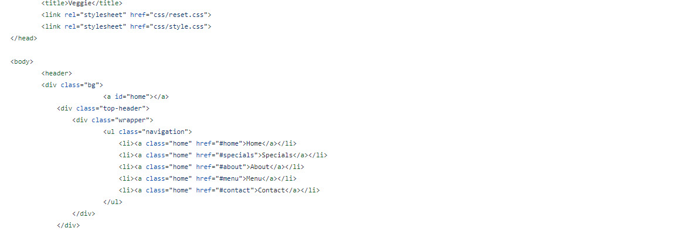

[rsschool-cv](https://YanaLusevich.github.io/rsschool-cv/)
# Yana Lusevich 
*Junior Front-end Developer*  
## Contacts
---
*Phone*: +375 44 575 51 12  
*E-mail*: preety_lynx@mail.ru  
*Skype*: yankaklimovich   
[LinkedIn](https://www.linkedin.com/in/%D1%8F%D0%BD%D0%B8%D0%BD%D0%B0-%D0%BA%D0%BB%D0%B8%D0%BC%D0%BE%D0%B2%D0%B8%D1%87-1a08a4106)   
*Addres*: Belarus, Minsk, Soltys str
## Personal profile 
--- 
Friendly, responsive, communicative and teamworker, has experience in personnel management, attentive, diligent. I love dogs, music and outdoor activities, doing agility and I help in the promotion and popularization of cynological sports in Belarus.
In IT sphere, I'm interested in the web, I studied information myself, I have basic knowledge of HTML, CSS.  
## Areas of expertise 
--- 
* Git  
* HTML  
* CSS   
* Markdown
## Work experience 
--- 
1. TeachMeSkills
2. RS School  
## My project 
--- 
A small part of code from my project  
  
## Education history 
--- 
1. Minsk State Medical College - 2012  
2. TeachMeSkills, course "HTML + CSS", qualification: junior HTML-layout designer - 2016  
3. TeachMeSkills, course "JavaScript", qualification: junior Front-end Developer - 2017  
4. RS School, course "JS/FE Pre-School" - 2021  
## Level of english  
---
*A1*